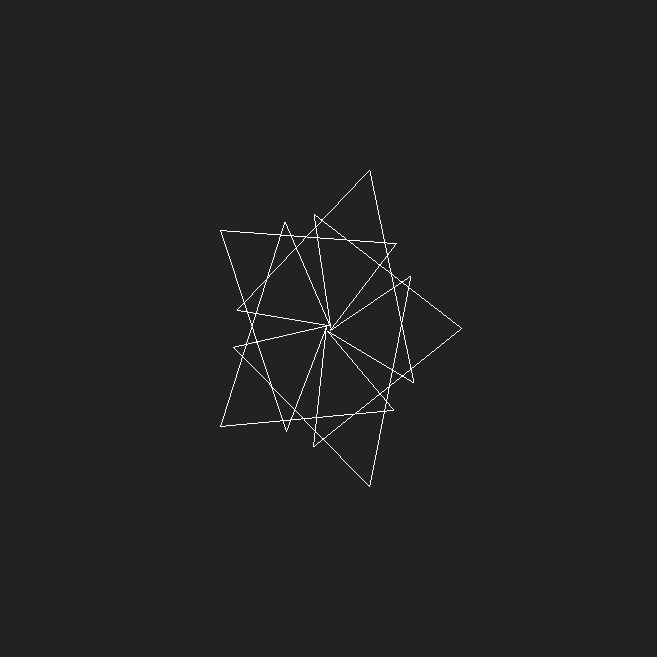
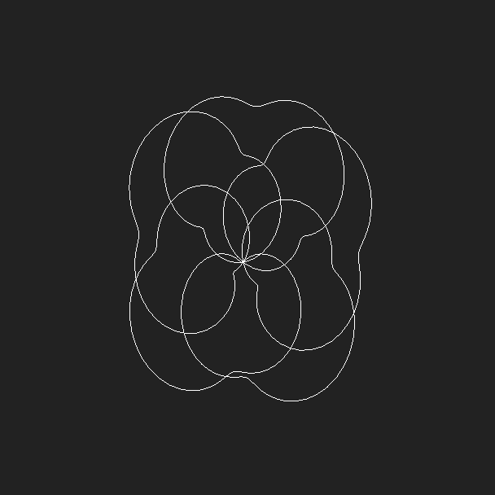
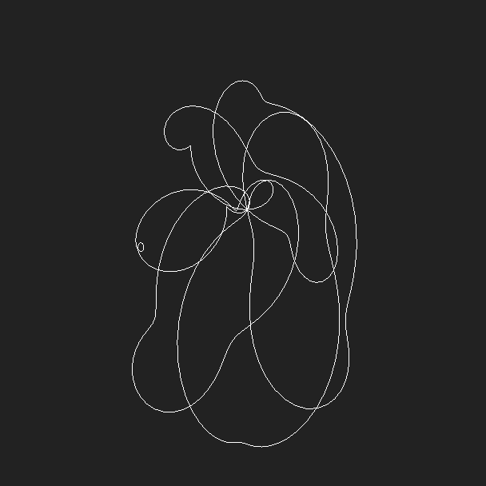
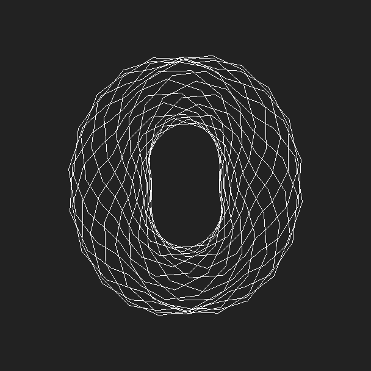
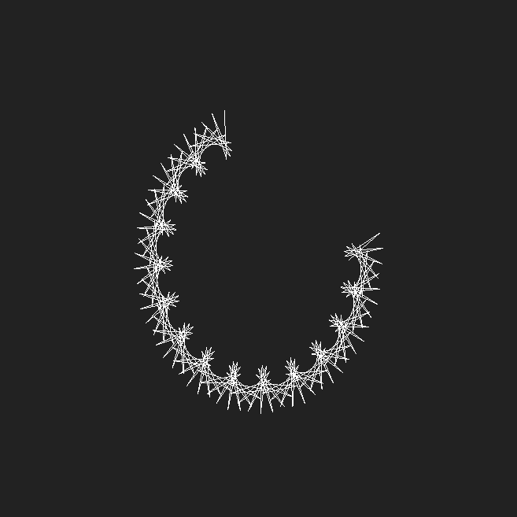
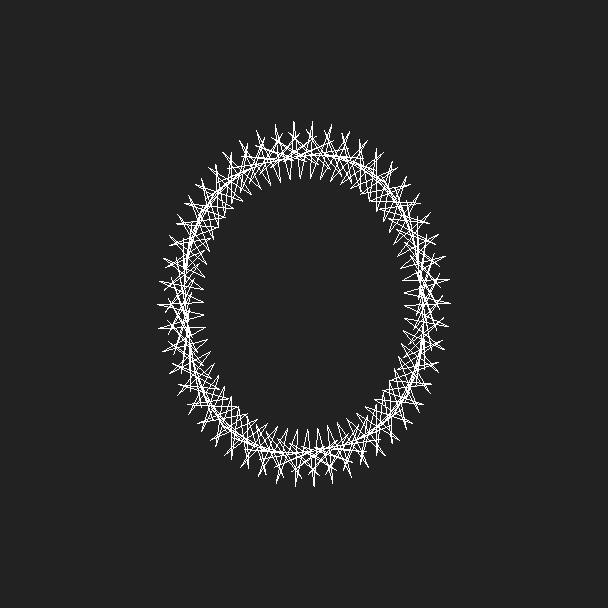

# Spiro 3D

This application draw and animate a 3d spirograph. Written in ES6, using preact, redux, three.js. [DEMO](https://fingerpich.github.io/spiro3d/?QRQD1EQW2VS20VC1VPFqVQW10VS6VC1VPFqVQW10VS1VC54VPTqeVD2EQW10VS5VC1VPFqeVD3EeqVOQAFVHTqq)

## Introduction

The original US-released Spirograph consisted of two different-sized plastic rings, with gear teeth on both the inside and outside of their circumferences. They were pinned to a cardboard backing with pins, and any of several provided gearwheels, which had holes provided for a ballpoint pen to extend through them to an underlying paper writing surface. It could be spun around to make geometric shapes on the underlying paper medium.
**In this application you could have n rings which are rotated inside each other and also you could rotate them in three dimensions.**

## Examples

