# Sinus Studio

Draws and animates a 3d spirograph-like curves using webGL.

## Examples
Click on the following examples so you would see lines animations and if you changed the parameters you would have another animation.

[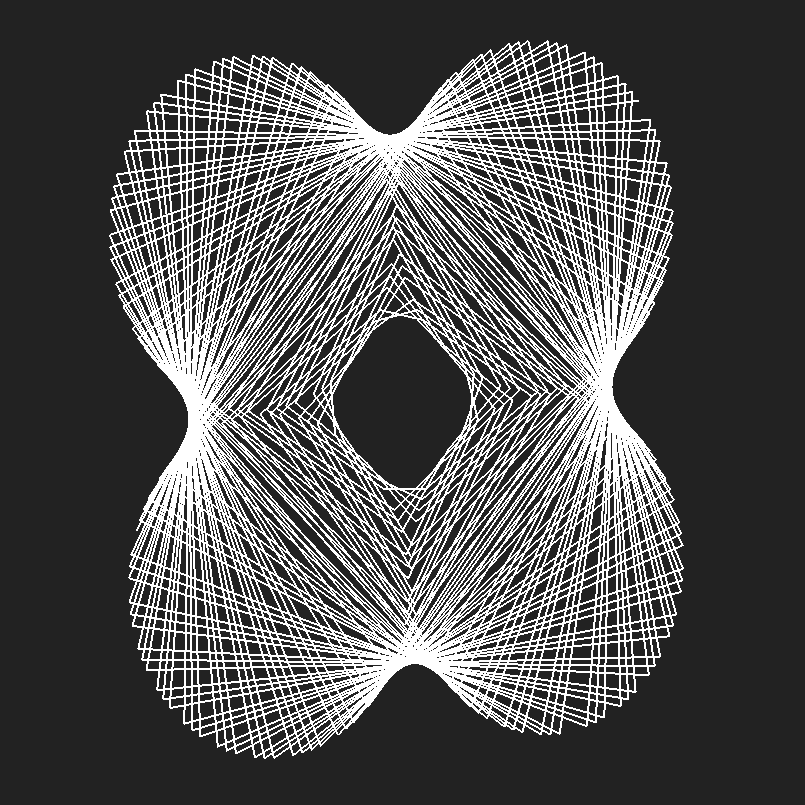](https://fingerpich.github.io/sinus-studio/?EEEE0V91V10V0ZVE0V120V7V1ZZVEZVEZZVE0V0V1V273V364V0ZZ)
[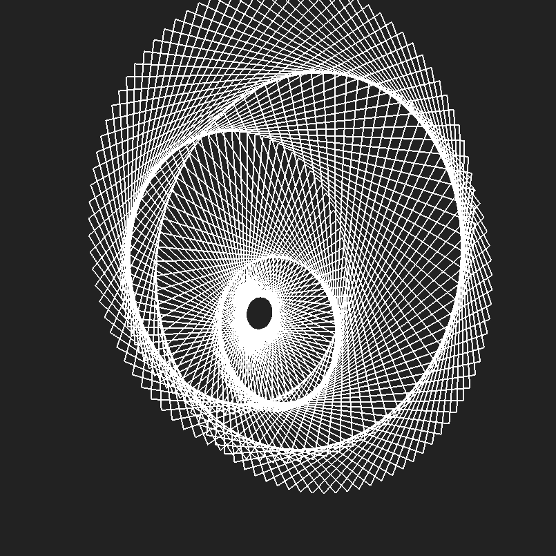](https://fingerpich.github.io/sinus-studio/?EEEE0V90V3V0ZVE61405V1V5V0ZVE0V91V8V1ZZVEZVEZZVE0V0V1V360V360V0ZZ)
[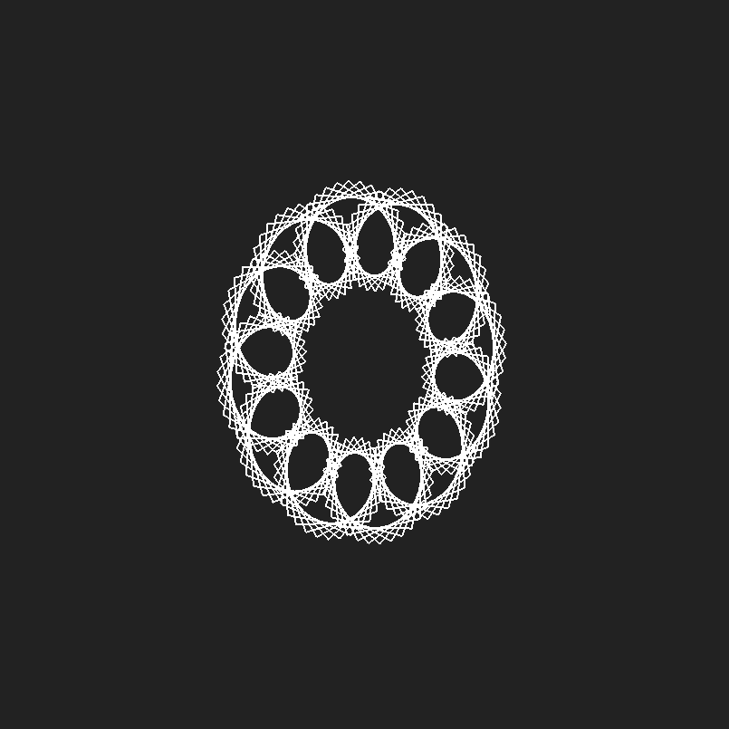](https://fingerpich.github.io/sinus-studio/?EEEE0V91V3V0ZVE0V7V7V1ZZVEZVEZZVE0V0V1V360V360V0ZZ)

[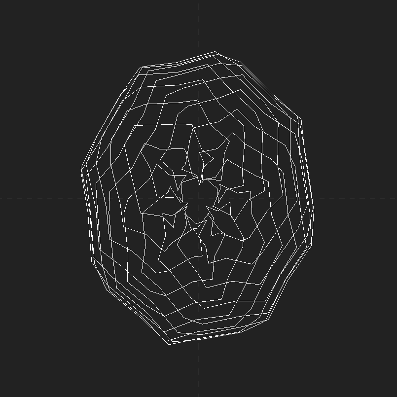](https://fingerpich.github.io/sinus-studio/?EEEE706V10V13V0ZVE3850V206V1V0ZVE0V21V10V1ZZVEZVEZZVE0V0V1V320V320V0ZZ)

[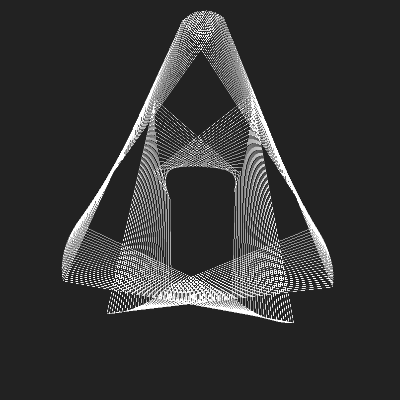](https://fingerpich.github.io/sinus-studio/?EEEE1419V105V10V0ZVE0V157V7V1ZZVEZVEZZVE0V0V1V327V419V1ZZ)
[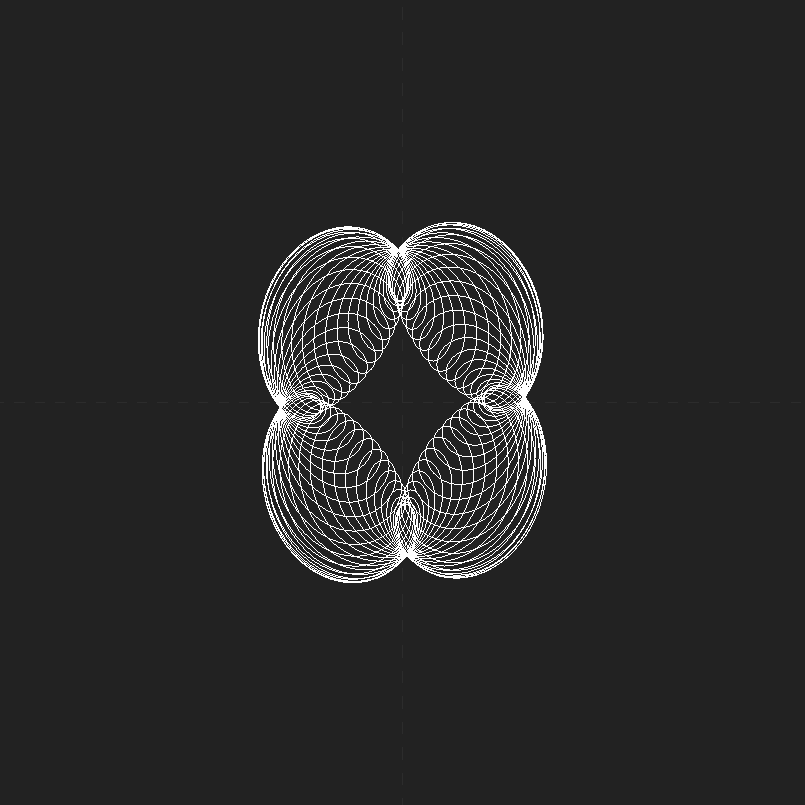](https://fingerpich.github.io/sinus-studio/?EEEE0V91V4V1ZVE64939V20V10V0ZVE0V11V2V1ZZVEZVEZZVE0V0V1V3600V3600V0ZZ)

[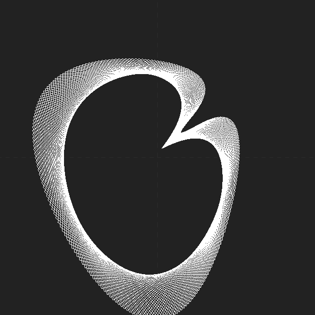](https://fingerpich.github.io/sinus-studio/?EEEE5490V47V18V0ZVE0V179V3V1ZVE0V94V13V1ZZVEZVEZZVE0V0V1V186V320V1ZZ)
[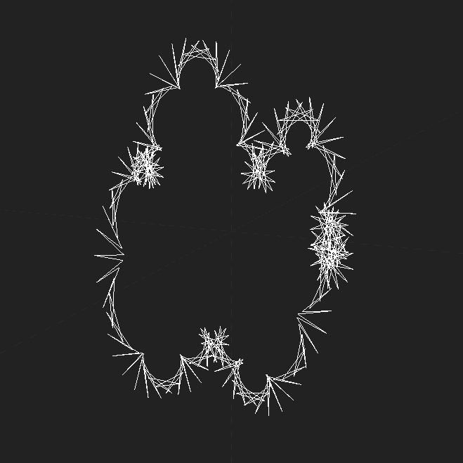](https://fingerpich.github.io/sinus-studio/?EEEE0V1V19V0ZVE0V173V3V1ZZVEE145V5V6V0ZVE0V2V5V1ZZVEZZVE0V0V1V320V320V0ZZ)

[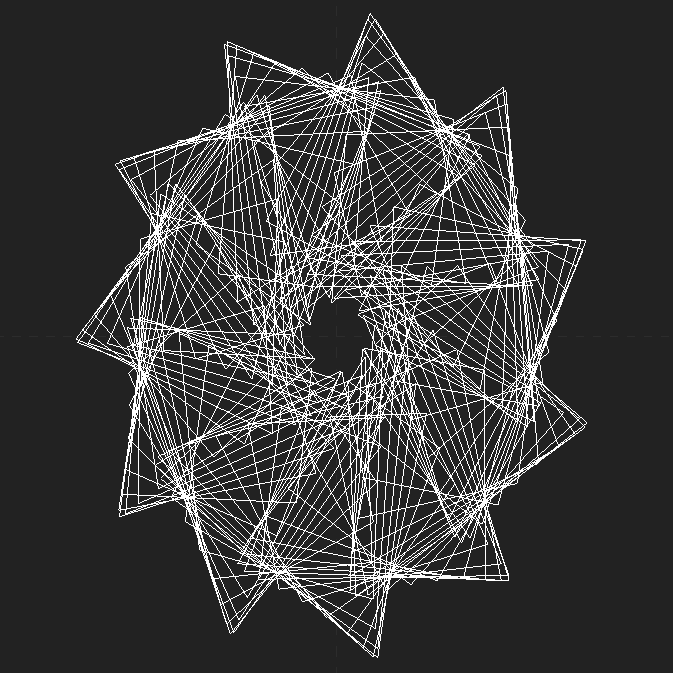](https://fingerpich.github.io/sinus-studio/?EEEE5441V14V16V0ZVE0V168V3V1ZVE0V97V13V1ZZVEZVEZZVE0V0V1V320V320V0ZZ)
[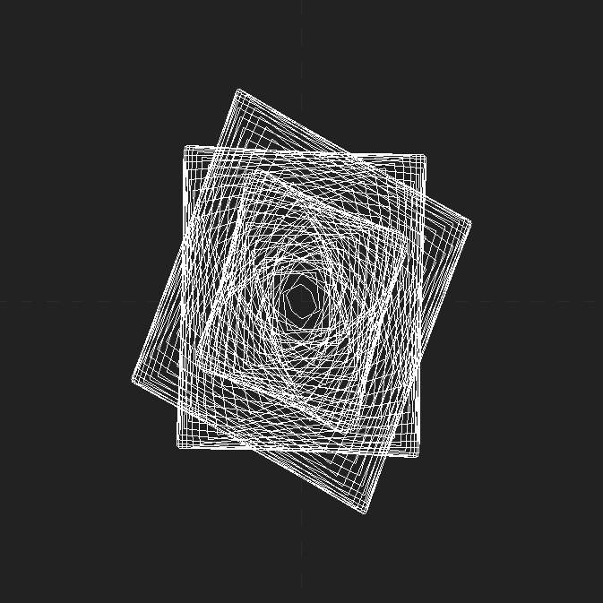](https://fingerpich.github.io/sinus-studio/?EEEE831V89V3V0ZVE67558V87V5V0ZVE0V93V7V1ZZVEZVEZZVE0V0V1V360V360V0ZZ)
[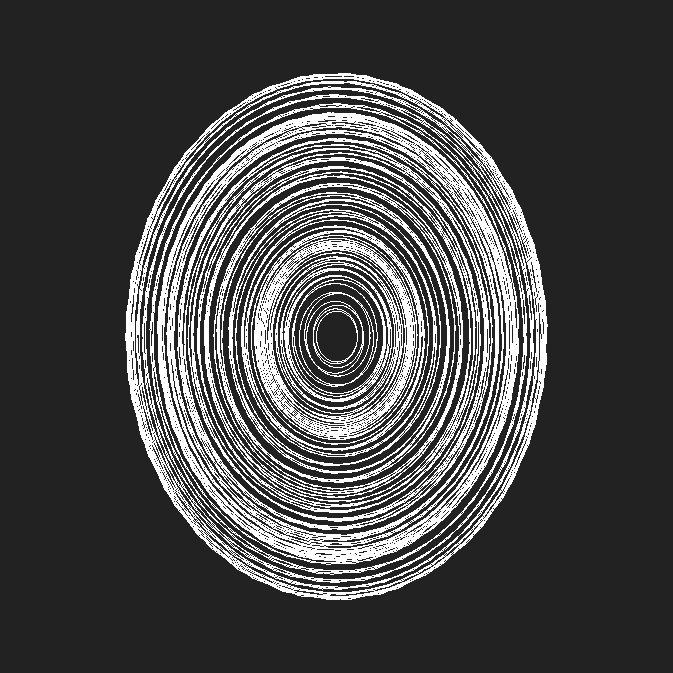](https://fingerpich.github.io/sinus-studio/?EEEE1750V186V10V0ZVE2820V188V6V0ZVE90V182V10V0ZZVEZVEZZVE0V0V1V270V5001V1ZZ)

[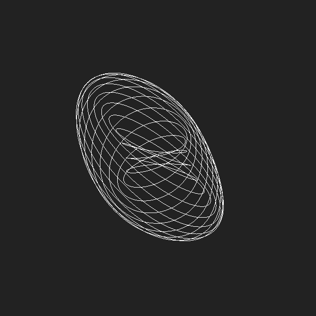](https://fingerpich.github.io/sinus-studio/?EEEE5482V19V8V0ZVE0V19V8V1ZZVEE0V16V6V1ZVE4872V19V6V0ZZVEE0V16V5V1ZVE4555V19V6V0ZZZVE0V0V0V3601V3601V0ZZ)

[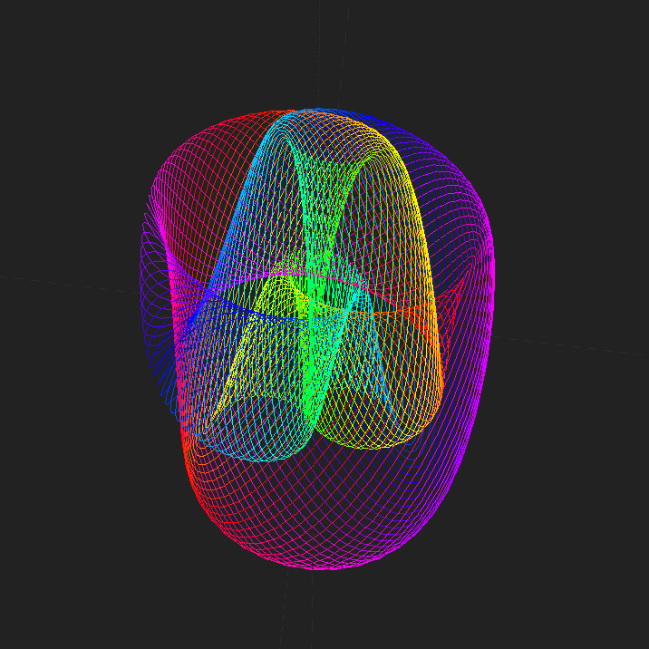](https://fingerpich.github.io/sinus-studio/?EEEE4910V177V10V0ZZVEE0V90V10V1ZZVEE0V89V10V1ZZZVE0V1V1V5000V5000V0ZZ)[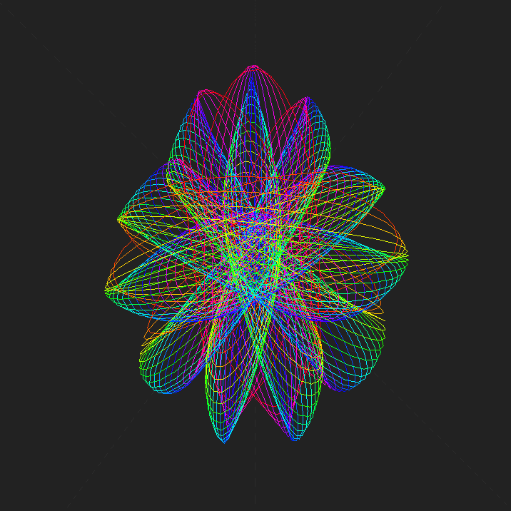](https://fingerpich.github.io/sinus-studio/?EEEE5298V177V10V0ZZVEE0V178V10V1ZZVEE0V148V10V1ZZZVE0V1V1V419V5000V1ZZ)
[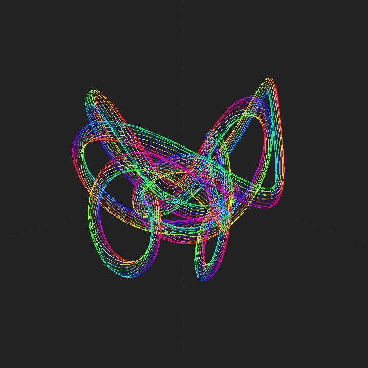](https://fingerpich.github.io/sinus-studio/?EEEE0V15V7V1ZVE0V61V2V1ZZVEE2120V135V10V0ZVE0V45V10V1ZZVEE0V45V10V1ZVE90V90V10V0ZVE90V75V10V0ZZZVE0V1V1V3600V3600V0ZZ)

## Introduction

A [Hypotrochoid](http://mathworld.wolfram.com/Hypotrochoid.html) is a 
[roulette](http://mathworld.wolfram.com/Roulette.html) traced by a point
 attached to a circle rolling around the inside of an another fixed circle.

The idea is using infinite number of roulette rolling around another 
roulette circle in a 3d space and each can be controlled.
